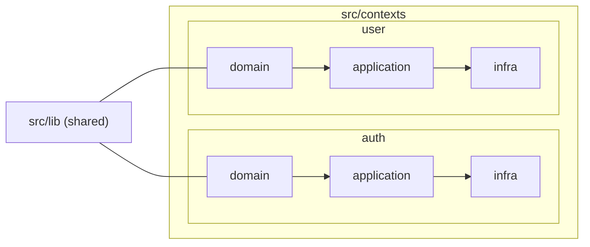

# DevHub Backend

Backend oficial de **DevHub**, construido siguiendo principios de *Domain-Driven Design (DDD)* y una arquitectura modular orientada a contextos.

---

## 🧭 Tabla de contenidos

- [DevHub Backend](#devhub-backend)
  - [🧭 Tabla de contenidos](#-tabla-de-contenidos)
  - [✨ Características](#-características)
  - [🏗️ Arquitectura](#️-arquitectura)
  - [📦 Estructura del proyecto](#-estructura-del-proyecto)
  - [🛠️ Tecnologías](#️-tecnologías)
  - [📐 Convenciones](#-convenciones)
  - [📄 Licencia](#-licencia)

---

## ✨ Características

* Arquitectura basada en *bounded contexts* (DDD).
* Separación estricta por capas: dominio, aplicación e infraestructura.
* Autenticación basada en JWT.
* Persistencia relacional con PostgreSQL.
* Código completamente tipado con TypeScript.
* Preparado para crecimiento y trabajo en equipo.

---

## 🏗️ Arquitectura

El código se organiza por **bounded contexts** dentro de `src/contexts` (por ejemplo, `auth` y `user`). Cada contexto encapsula su propio dominio y evita dependencias directas con otros contextos.

Cada contexto sigue una separación clara por capas:

* **`domain`**: núcleo del dominio (entidades, *value objects*, reglas de negocio e interfaces).
* **`application`**: casos de uso y orquestación del dominio.
* **`infra`**: adaptadores e implementación de detalles técnicos (persistencia, HTTP, etc.).

Los elementos compartidos entre contextos residen en `src/lib` (por ejemplo, la configuración de la base de datos).

---

## 📦 Estructura del proyecto

* `src/contexts`: bounded contexts independientes.
* `src/lib`: código compartido entre contextos.
* `src/main.ts`: punto de entrada de la aplicación.
* `src/app.module.ts`: módulo raíz de NestJS.

---

## 🛠️ Tecnologías

* **Node.js** + **TypeScript**
* **NestJS**
* **PostgreSQL**
* **TypeORM**
* **JWT** y **bcrypt**
* **class-validator** / **class-transformer**
* **dotenv**
* **Helmet**

---

## 📐 Convenciones

* El **dominio no depende** de infraestructura ni de NestJS.
* Los casos de uso se exponen mediante servicios de aplicación.
* La infraestructura implementa interfaces definidas en el dominio.
* No se comparten entidades entre contextos.

---

## 📄 Licencia

Este proyecto se distribuye bajo la licencia MIT. Consulta el archivo `LICENSE` para más información.
